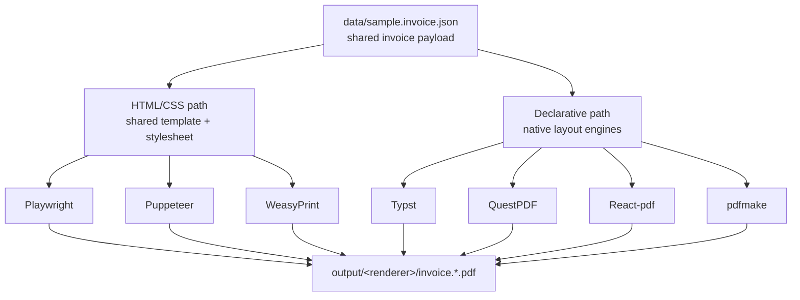

# Invoice Renderer PoCs


**One invoice data model, seven renderers — compare print-oriented PDF toolchains side by side.**

This repo holds a single shared invoice payload (`data/sample.invoice.json`) and seven
proof-of-concept renderers that each turn it into a print-ready invoice. Three of them render the
same HTML/CSS template through a headless browser or Python engine, so they form a close visual
baseline; the rest are independent, declarative implementations (Typst, QuestPDF, React-pdf,
pdfmake). The goal is a fair, runnable comparison of authoring style, output fidelity, dependencies,
and maintenance cost — not a production billing system.

The fixture data is intentionally fictitious (`billing@example.com`, placeholder bank codes), so it
is safe to commit and share.

## ✨ Features

- **Seven renderers, one schema** — change the data once, regenerate every output.
- **Shared HTML/CSS baseline** — Playwright, Puppeteer, and WeasyPrint all render
  `templates/invoice.html.njk` + `styles/invoice.css`, so differences are due to the engine, not the
  markup.
- **Declarative alternatives** — Typst, QuestPDF, React-pdf, and pdfmake implement the layout
  natively, letting you compare authoring ergonomics and toolchain weight.
- **Print-first layout** — A4 page size, paged media, and three logical pages (invoice, export note,
  generated-note footer) in every renderer.
- **Shared formatting** — currency and date filters are replicated consistently across the Node,
  Python, C#, and Typst entry points.
- **Self-configuring on macOS** — the WeasyPrint script wires up Homebrew library paths and a
  writable fontconfig cache; pdfmake auto-discovers system Arial TTFs.
- **Fictitious fixtures only** — no real customer, bank, or contact data lives in the repo.

## 📦 Installation

You only need the toolchain for the renderer(s) you want to compare. All commands run from the repo
root.

### Prerequisites by renderer

| Renderer | Requires |
| --- | --- |
| HTML preview, Playwright, Puppeteer, React-pdf, pdfmake | Node.js (recent LTS) |
| WeasyPrint | Python 3 |
| Typst | [Typst](https://github.com/typst/typst#installation) CLI |
| QuestPDF | .NET 10 SDK |

### Node dependencies

```bash
npm install
```

### Playwright browser (only for `pdf:playwright`)

```bash
npm run bootstrap:playwright
```

### Python dependencies (only for WeasyPrint)

```bash
python3 -m pip install -r requirements.txt
```

## 🚀 Usage

### Quick start — HTML preview

Fastest path to see the invoice. No browser binary or PDF toolchain required.

```bash
npm install
npm run render:html
```

Writes `output/html/invoice.preview.html`. Open it in a browser:

```bash
open output/html/invoice.preview.html
```

### Generate any PDF

Each command reads `data/sample.invoice.json` and writes one PDF under `output/<renderer>/`:

```bash
npm run pdf:playwright
```

```bash
npm run pdf:puppeteer
```

```bash
npm run pdf:react-pdf
```

```bash
npm run pdf:pdfmake
```

```bash
python3 python/render_weasyprint.py
```

```bash
typst compile --root . typst/invoice.typ output/typst/invoice.typst.pdf
```

On macOS with Homebrew .NET, point `DOTNET_ROOT` at the SDK so the project resolves:

```bash
DOTNET_ROOT="/opt/homebrew/opt/dotnet/libexec" dotnet run --project questpdf/InvoicePoc
```

### Expected outputs

| Command | Output |
| --- | --- |
| `npm run render:html` | `output/html/invoice.preview.html` |
| `npm run pdf:playwright` | `output/playwright/invoice.playwright.pdf` |
| `npm run pdf:puppeteer` | `output/puppeteer/invoice.puppeteer.pdf` |
| `npm run pdf:react-pdf` | `output/react-pdf/invoice.react-pdf.pdf` |
| `npm run pdf:pdfmake` | `output/pdfmake/invoice.pdfmake.pdf` |
| `python3 python/render_weasyprint.py` | `output/weasyprint/invoice.weasyprint.pdf` |
| `typst compile …` | `output/typst/invoice.typst.pdf` |
| `dotnet run --project questpdf/InvoicePoc` | `output/questpdf/invoice.questpdf.pdf` |

The WeasyPrint script and QuestPDF program also accept a custom destination via `--output` and a
positional path argument respectively. `output/` is gitignored and stays empty in commits.

## ⚙️ Configuration

pdfmake on Node embeds TTF fonts directly, so it needs local font files. The renderer probes common
macOS Arial locations first; override any of them with environment variables if your fonts live
elsewhere.

| Variable | Default | Description |
| --- | --- | --- |
| `PDFMAKE_FONT_NORMAL` | `/System/Library/Fonts/Supplemental/Arial.ttf` | Regular TTF used as the base face. |
| `PDFMAKE_FONT_BOLD` | macOS `Arial Bold.ttf` | Bold face; falls back to `PDFMAKE_FONT_NORMAL`. |
| `PDFMAKE_FONT_ITALIC` | macOS `Arial Italic.ttf` | Italic face; falls back to `PDFMAKE_FONT_NORMAL`. |
| `PDFMAKE_FONT_BOLDITALIC` | macOS `Arial Bold Italic.ttf` | Bold-italic face; falls back to `PDFMAKE_FONT_BOLD`. |

Example:

```bash
PDFMAKE_FONT_NORMAL=/usr/share/fonts/truetype/dejavu/DejaVuSans.ttf \
PDFMAKE_FONT_BOLD=/usr/share/fonts/truetype/dejavu/DejaVuSans-Bold.ttf \
npm run pdf:pdfmake
```

## 🧱 How it works

A single JSON payload feeds every renderer. Three renderers share one HTML/CSS template (the closest
visual comparison); the other four declare layout natively in their own DSL or component tree.



### Repo layout

| Path | Role |
| --- | --- |
| `data/sample.invoice.json` | Shared invoice payload (fictitious). Field names are the contract. |
| `templates/invoice.html.njk` | Nunjucks/Jinja2 template, shared by the HTML/CSS path. |
| `styles/invoice.css` | Print-first stylesheet, shared by the HTML/CSS path. |
| `scripts/` | Node ESM entry points; shared helpers in `scripts/lib/`. |
| `python/render_weasyprint.py` | WeasyPrint renderer. |
| `typst/invoice.typ` | Typst template. |
| `questpdf/InvoicePoc/` | .NET / QuestPDF implementation. |
| `output/` | Generated artifacts only; gitignored. |

## 🤝 Contributing

There is no test suite yet — validate changes by rerunning the affected generator and inspecting
`output/`. When changing the shared schema or layout, verify at least one HTML/CSS path **and** one
declarative path. Follow existing style (2 spaces in `.mjs`/CSS/HTML/JSON, 4 spaces in Python and
C#), and never commit real customer data, bank details, or generated PDFs.

## 📄 License

No license file is present in this repository, so the work is reserved by default. Add a `LICENSE`
file before distributing or depending on it.
